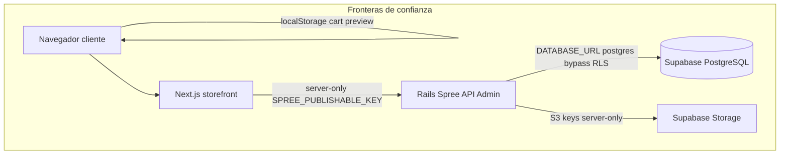
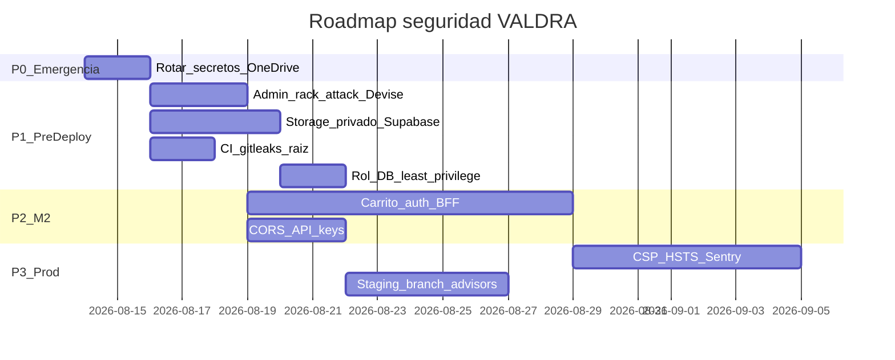

# Plan maestro de auditoría e implementación de seguridad — VALDRA

## 1. Síntesis consolidada (3 auditorías + Supabase live)

Se analizaron:
- Auditoría Cursor (sesión anterior)
- [`auditoria-seguridad-valdra.md`](c:\Users\jhanc\Downloads\auditoria-seguridad-valdra.md)
- [`AUDITORIA_SEGURIDAD.md`](c:\Users\jhanc\Downloads\AUDITORIA_SEGURIDAD.md)
- Proyecto Supabase **Valdra_Store** (`fnwcqwaxwhiqavtdxqzk`, `ACTIVE_HEALTHY`, us-east-1)

**Postura actual:** base sólida para pre-producción (M0 hecho, M1 en curso). **No hay vulnerabilidades explotables hoy en el storefront** (sin checkout, sin auth real). El riesgo se concentra en **secretos**, **admin sin throttling**, **dependencias**, **arquitectura de storage** y **deuda de M2** (carrito client-side).



---

## 2. Matriz unificada de hallazgos

| ID | Severidad | Tipo | Fuentes | Resumen |
|----|-----------|------|---------|---------|
| **U-01** | CRITICAL | Confirmado | 3/3 | Credenciales reales en [`commerce/.env`](commerce/.env) (DB + Storage S3) en texto plano; proyecto en OneDrive |
| **U-02** | HIGH | Confirmado | 3/3 | `/admin/login` sin `:lockable`, sin `rack-attack`, contraseñas min 6 chars ([`devise.rb:181`](commerce/config/initializers/devise.rb)) |
| **U-03** | HIGH | Confirmado | Cursor + bundler-audit | Devise 4.9.4 con CVE-2026-32700 y CVE-2026-40295 → actualizar ≥ 5.0.4 |
| **U-04** | HIGH | Confirmado | Cursor + Supabase live | Rails usa rol `postgres` con `rolbypassrls=true` → filtración de `DATABASE_URL` = acceso total BD |
| **U-05** | HIGH | Deuda M2 | 3/3 | Carrito/precios solo en cliente ([`cart-provider.tsx`](src/features/cart/components/cart-provider.tsx), [`cart-page.tsx`](src/features/cart/components/cart-page.tsx)) |
| **U-06** | HIGH | Deuda M2 | Cursor + Audit2 | Auth cliente stub ([`auth-form.tsx:11`](src/features/account/components/auth-form.tsx)) |
| **U-07** | MEDIUM | Confirmado | Audit1 + Audit2 | Un solo bucket/servicio storage; `source_attachment` en servicio "público" de Spree ([`asset_decorator.rb:8`](commerce/app/models/spree/asset_decorator.rb)) |
| **U-08** | MEDIUM | Confirmado | Audit2 + Cursor | CSP Rails comentada ([`content_security_policy.rb`](commerce/config/initializers/content_security_policy.rb)) |
| **U-09** | MEDIUM | Confirmado | 3/3 | CSP Next con `'unsafe-inline'` prod ([`next.config.ts:32`](next.config.ts)) |
| **U-10** | MEDIUM | Confirmado | 3/3 | `STOREFRONT_ORIGIN` documentado pero **no usado**; sin CORS explícito |
| **U-11** | MEDIUM | Confirmado | Audit1 + Audit2 | Mailer placeholder `example.com` ([`production.rb:61`](commerce/config/environments/production.rb)) |
| **U-12** | MEDIUM | Parcial | Audit1 vs Audit2 | CI: **commerce SÍ tiene** [`commerce/.github/workflows/ci.yml`](commerce/.github/workflows/ci.yml); **raíz Next.js NO tiene CI** |
| **U-13** | MEDIUM | Posible | Audit1 | Next.js 16.3.0 — verificar parches CVE-2026-64645/64642 antes de prod |
| **U-14** | MEDIUM | Confirmado | Supabase live | 137 tablas con RLS ON pero **0 políticas** — seguro para `anon`/`authenticated` (deny default), **no protege** conexión Rails |
| **U-15** | LOW | Supabase live | Advisor | Extensión `pg_trgm` en schema `public` (WARN) |
| **U-16** | LOW | Supabase live | SQL | 2 API keys publishable activas (posible duplicado/rotación pendiente) |
| **U-17** | LOW | Confirmado | Audit1 | Decompression bomb parcial en [`image_normalizer.py`](commerce/lib/valdra/image_normalizer.py) |
| **U-18** | LOW | Confirmado | Audit2 | rembg descarga modelo en runtime (supply chain) |
| **U-19** | INFO | Supabase live | Bucket `catalog-public` tiene **`public: false`** — el nombre engaña; no es bucket world-readable |
| **U-20** | INFO | 3/3 | Buenas prácticas: `server-only`, `force_ssl`, Docker non-root, Brakeman 0 warnings, `pnpm audit` clean |

### Correcciones respecto a auditorías previas

1. **Bucket Supabase:** live confirma `catalog-public.public = false` y **0 storage policies**. El riesgo U-07 es **arquitectural** (originales + normalizados en mismo bucket/servicio Spree), no exposición anónima directa del bucket.
2. **CI:** Audit2 indicaba ausencia total; en realidad **commerce tiene CI** (Brakeman + bundler-audit). Falta CI en **monorepo raíz** para Next.js.
3. **RLS:** Audit2 lo descartó; live muestra RLS habilitado en todas las tablas Spree **sin políticas** → protección pasiva vía PostgREST, **irrelevante** para Rails con `postgres`.

---

## 3. Programa de auditoría completo (metodología Codex Security)

### Fase A — Reconocimiento (1 día, solo lectura)
- Mapear superficie: rutas Next (`src/app/`), Spree engine (`/admin`, `/api/v3/store/*`), jobs (`NormalizeAssetJob`), env vars
- Inventariar secretos: `.env*`, `master.key`, OneDrive sync, primer commit pendiente
- Documentar flujos de datos: catálogo server-side, carrito client-side, imágenes Active Storage

### Fase B — SAST estático (1–2 días)
| Herramienta | Alcance | Comando / ubicación |
|-------------|---------|---------------------|
| Brakeman | Rails custom | `commerce/bin/brakeman` (ya en CI) |
| bundler-audit | Gems Ruby | `commerce/bin/bundler-audit` — **Devise CVE pendiente** |
| pnpm audit | Next.js | raíz — hoy clean |
| gitleaks / secret scanning | todo repo | **falta — añadir en CI** |
| ESLint security | storefront | `pnpm lint` en CI raíz |
| Revisión manual | auth, cart, CSP, CORS | archivos citados arriba |

### Fase C — Auditoría Supabase live (ejecutada + repetir tras cambios)

**Proyecto:** Valdra_Store (`fnwcqwaxwhiqavtdxqzk`)

| Check | Resultado actual | Acción |
|-------|------------------|--------|
| Security Advisor | 137 INFO (RLS sin policy), 1 WARN (`pg_trgm`) | Documentar; mover extensión; no crear policies permissivas innecesarias |
| Performance Advisor | Ejecutado (214KB output) | Revisar índices en tablas Spree calientes pre-M2 |
| RLS en `public.*` | ON en ~140 tablas, 0 policies | **Mantener deny-default** para Data API; no usar anon key en app |
| Roles DB | `postgres` bypass RLS | **Crear rol `valdra_app` least-privilege** |
| Storage bucket | 1 bucket privado, 14 objetos | Separar bucket privado para sources; policies mínimas |
| PostgREST/Data API | pg_graphql/pg_net no instalados | Mantener deshabilitado si no se usa |
| API keys Spree | 2 publishable activas | Auditar scopes; revocar duplicada |
| Backups / branching | Pendiente M3 | Crear branch staging antes de prod |

### Fase D — Threat modeling (medio día)
Aplicar STRIDE a 3 caminos críticos:
1. Compromiso admin → SuperUser Spree
2. Filtración `DATABASE_URL` → exfiltración pedidos/clientes
3. Checkout M2 mal implementado → manipulación precio/stock

### Fase E — Validación post-remediación (antes de cada deploy)
- Checklist GOALS M1/M3 + re-ejecutar advisors Supabase
- Pentest ligero: brute force admin (debe bloquear), IDOR pedidos (cuando existan), CSP headers

---

## 4. Plan de implementación por fases

### P0 — Emergencia (24–48 h, bloqueante)

**Objetivo:** contener exposición de secretos.

1. **Rotar credenciales Supabase** (Dashboard → Database password + Storage S3 keys)
2. **Mover repo fuera de OneDrive** o excluir `.env*`, `config/master.key` de sync
3. **Verificar historial git** antes del primer commit: `git log --all -- commerce/.env`
4. **Pre-commit hook:** bloquear `.env`, `master.key`, patrones `sk-`, `postgresql://`
5. **Documentar** rotación en runbook interno (no commitear secretos)

**Archivos afectados:** ninguno en repo (operacional); actualizar [`.env.example`](.env.example) y [`commerce/.env.example`](commerce/.env.example) con instrucciones de gestor de secretos.

---

### P1 — Pre-deploy / Pre-primer-push (1 semana)

**Objetivo:** endurecer admin, dependencias, CI, storage.

#### 1.1 Admin hardening (U-02, U-03)
- [`commerce/app/models/spree/admin_user.rb`](commerce/app/models/spree/admin_user.rb): añadir `:lockable`, `:timeoutable`
- [`commerce/config/initializers/devise.rb`](commerce/config/initializers/devise.rb): `password_length = 12..128`, `config.paranoid = true`
- Añadir gem `rack-attack` + initializer throttle `/admin/login` (5 req/min IP, 10 req/15min email)
- Actualizar Devise ≥ 5.0.4 en [`commerce/Gemfile`](commerce/Gemfile)

#### 1.2 Storage architecture (U-07)
- Crear bucket Supabase **`catalog-private`** (privado)
- [`commerce/config/storage.yml`](commerce/config/storage.yml): servicio `:supabase_private`
- [`commerce/config/initializers/spree.rb`](commerce/config/initializers/spree.rb):
  ```ruby
  Spree.private_storage_service_name = :supabase_private
  Spree.public_storage_service_name = :supabase  # solo WebP normalizado
  ```
- [`commerce/app/models/spree/asset_decorator.rb`](commerce/app/models/spree/asset_decorator.rb): `source_attachment` → servicio **privado**
- Migrar objetos source existentes (script rake one-time)

#### 1.3 Supabase DB role (U-04, U-14)
- Crear rol `valdra_app` con GRANT mínimo sobre tablas Spree (no superuser, no bypass RLS)
- Actualizar `DATABASE_URL` en producción/staging para usar ese rol
- **No** añadir policies RLS permissivas salvo uso futuro de PostgREST

#### 1.4 CI unificado (U-12)
- **Raíz:** `.github/workflows/storefront-ci.yml` → `pnpm install --frozen-lockfile`, `lint`, `typecheck`, `build`, `pnpm audit`
- **Raíz:** `.github/workflows/security.yml` → gitleaks + Dependabot npm
- **Commerce:** mantener CI existente; añadir `bin/ci` al workflow
- Fijar SHA de actions (L-1 de Audit1)

#### 1.5 Config producción Rails (U-11)
- [`commerce/config/environments/production.rb`](commerce/config/environments/production.rb): `APP_HOST` desde ENV para mailer
- Configurar SMTP en `credentials.yml.enc`

---

### P2 — M1 completado + M2 checkout seguro (2–3 semanas)

**Objetivo:** cumplir criterios GOALS M2 — *"nunca acepta precio/stock del navegador"*.

#### 2.1 Carrito server-side (U-05)
- Eliminar persistencia de precios en `localStorage`; guardar solo `cart_token` de Spree
- Nuevos Route Handlers Next.js: `src/app/api/cart/*` → proxy a Store API v3
- [`cart-page.tsx`](src/features/cart/components/cart-page.tsx): total siempre desde respuesta Spree

#### 2.2 Auth BFF (U-06)
- Reemplazar stub en [`auth-form.tsx`](src/features/account/components/auth-form.tsx)
- Sesión en cookies `httpOnly; Secure; SameSite=Strict` vía Route Handlers
- **Nunca** exponer `SPREE_PUBLISHABLE_KEY` al cliente (mantener `server-only`)

#### 2.3 CORS / origen (U-10)
- Implementar `STOREFRONT_ORIGIN` en Spree (`spree_allowed_origins` o rack-cors)
- Allow-list estricta: solo dominio prod + staging

#### 2.4 API keys audit (U-16)
- Revisar 2 publishable keys en `spree_api_keys`; revocar duplicada
- Scopes mínimos: lectura catálogo; clave separada para checkout si aplica

---

### P3 — Hardening producción (paralelo a M3)

#### 3.1 Headers y CSP (U-08, U-09, M5)
- Activar CSP Rails admin con nonces (Turbo-compatible)
- Next.js: middleware nonce CSP; eliminar `'unsafe-inline'` en prod gradualmente
- Añadir HSTS explícito en [`next.config.ts`](next.config.ts)
- Restringir `img-src` y `remotePatterns` a dominios VALDRA/Supabase (quitar localhost en prod)

#### 3.2 Imágenes y jobs (U-17, U-18)
- [`image_normalizer.py`](commerce/lib/valdra/image_normalizer.py): `Image.MAX_IMAGE_PIXELS`, validar dimensiones
- Pre-descargar modelo rembg en [`commerce/Dockerfile`](commerce/Dockerfile) build stage
- Bloquear override de `VALDRA_IMAGE_NORMALIZER_COMMAND` en producción

#### 3.3 Supabase operaciones
- Branch staging (`create_branch`) para dev/test aislado
- Re-ejecutar `get_advisors` security+performance
- Verificar backups y capacidad (GOALS M3)
- Mover `pg_trgm` fuera de `public` (U-15)

#### 3.4 Observabilidad y gobernanza
- Sentry storefront + Rails
- `SECURITY.md` + canal de reporte responsable
- Checklist pre-lanzamiento en [`docs/GOALS.md`](docs/GOALS.md) M3

---

### P4 — Auditoría continua (ongoing)

| Trigger | Acciones |
|---------|----------|
| Cada PR | CI completo (lint, audit, brakeman, gitleaks) |
| Cierre M1 | Re-audit Supabase advisors |
| Antes M2 checkout | Threat model checkout + review IDOR |
| Antes prod | Pentest manual admin + checkout COD |
| Mensual | Rotación API keys, revisión Dependabot |

---

## 5. Criterios de aceptación (Definition of Done seguridad)

- [ ] Cero secretos en disco sincronizado; credenciales rotadas post-auditoría
- [ ] Admin: lockable + rack-attack + password ≥ 12 + Devise ≥ 5.0.4
- [ ] Storage: sources en bucket privado; catálogo normalizado en bucket dedicado
- [ ] DB: rol `valdra_app` least-privilege en uso
- [ ] CI raíz + commerce verdes; gitleaks activo
- [ ] Carrito/checkout 100% server-side (M2)
- [ ] Supabase advisors: 0 WARN/ERROR críticos; staging branch operativo
- [ ] CSP/HSTS configurados; mailer con host real
- [ ] `SECURITY.md` publicado

---

## 6. Orden de ejecución recomendado



**Estimación total:** ~4–5 semanas hasta production-ready security, alineado con M1→M3.
